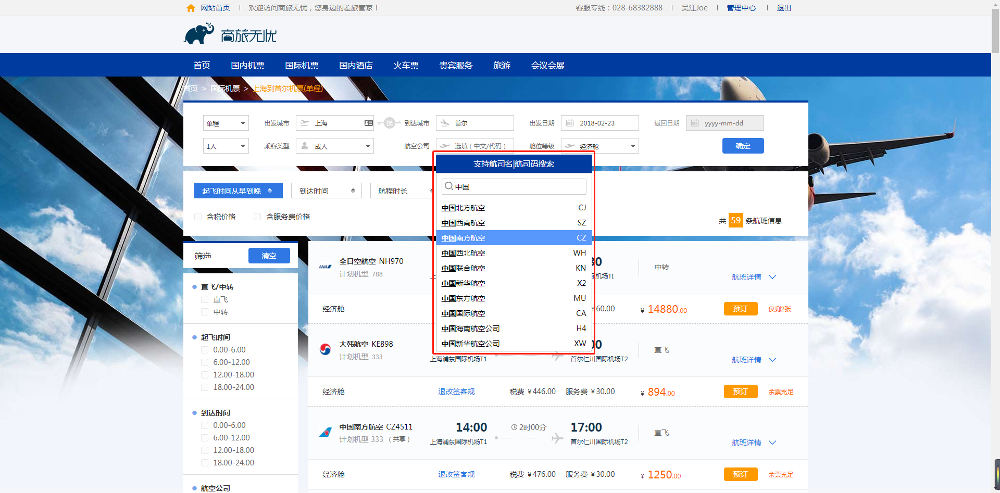
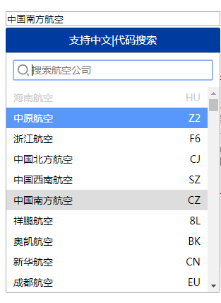
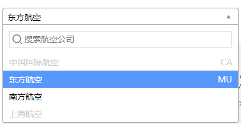
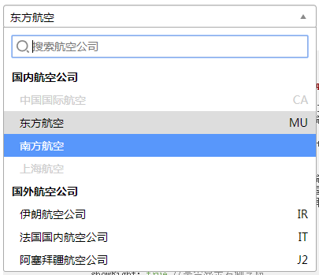
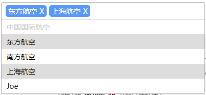
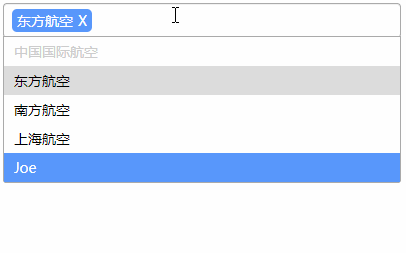
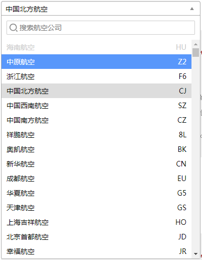

# Slwy.Selector
Slwy简易选择列表插件



# 使用

## 绑定元素为`<input>`时

截图



示例代码：
```html
    <input type="text" class="demo-input" placeholder="选填（中文/代码）">

```
```js
    $('input.demo-input').SlwySelector({
        title: '支持中文|代码搜索',//自定义标题
        titleBar: true,//是否显示标题栏
        data: data,//自定义数据
        showField: 'CarrierName',//需要展示的自定义数据字段名
        showRight: true,//是否显示右侧字段
        showRightField: 'CarrierCode',//需要展示的右侧自定义数据字段名
        search: true,//是否显示搜索
        searchPlaceholder: '搜索航空公司'//搜索栏placeholder
    })
    //选择事件
    /*.on('selected', function (e) {
        console.log(e.value)
    })*/
```


## 绑定元素为`<select>`时

截图




示例代码：
```html
    <select name="select" class="demo-select">
        <option value="CA" data-right="CA" disabled>中国国际航空</option>
        <option value="MU" data-right="MU">东方航空</option>
        <option value="CZ">南方航空</option>
        <option value="FM" disabled>上海航空</option>
    </select>
```
```js
    $('select.demo-select').SlwySelector({
        showRight: true,//是否显示右侧字段
        search: true,//是否显示搜索
        searchPlaceholder: '搜索航空公司'//搜索栏placeholder
    })
    //选择事件
    /*.on('selected', function (e) {
        console.log(e.value)
    })*/
```


**使用自定义数据**

示例代码：

```html
    <select name="select" class="demo-select-optgroup-data">
    </select>
```
```json
    //自定义data
    [
        {
            "KeyID": 0,
            "CarrierCode": "HU",
            "CarrierShortName": "海南航空",
            "CarrierName": "海南航空",
            "SettleCode": "0",
            "CountryType": 0,
            "CountryTypeName": "国内",
            "IsDelete": 0,
            "AddTime": "0001-01-01T00:00:00",
            "AddUser": "",
            "ModifyUser": ""
        },
        ...
    ]
```
```js
    $('select.demo-select-data').SlwySelector({
        data: data,//自定义数据
        showField: 'CarrierName',//需要展示的自定义数据字段名
        showRight: true,//是否显示右侧字段
        showRightField: 'CarrierCode',//需要展示的右侧自定义数据字段名
        search: true,//是否显示搜索
        searchPlaceholder: '搜索航空公司'//搜索栏placeholder
    })
    //选择事件
    /*.on('selected', function (e) {
        console.log(e.value)
    })*/
```

> 若同时存在`<option></option>`与自定义data，优先使用data


## 绑定有`optgroup`的`<select>`时

截图



示例代码：

```html
    <select name="select" class="demo-select-optgroup">
        <optgroup label="国内航空公司">
            <option value="CA" data-right="CA" disabled>中国国际航空</option>
            <option value="MU" data-right="MU">东方航空</option>
            <option value="CZ">南方航空</option>
            <option value="FM" disabled>上海航空</option>
        </optgroup>
        <optgroup label="国外航空公司">
            <option value="IR" data-right="IR">伊朗航空公司</option>
            <option value="IT" data-right="IT">法国国内航空公司</option>
            <option value="J2" data-right="J2">阿塞拜疆航空公司</option>
        </optgroup>
    </select>
```
```js
    $('select.demo-select-optgroup').SlwySelector({
        showRight: true,//是否显示右侧字段
        search: true,//是否显示搜索
        searchPlaceholder: '搜索航空公司'//搜索栏placeholder
    })
    //选择事件
    /*.on('selected', function (e) {
        console.log(e.value)
    })*/
```
            
**使用自定义数据**

示例代码：

```html
    <select name="select" class="demo-select-optgroup-data">
    </select>
```
```json
    //自定义data
    [
        {
            "label": "国内航空公司",
            "optgroup": true,
            "options": [
                {
                    "KeyID": 0,
                    "CarrierCode": "HU",
                    "CarrierShortName": "海南航空",
                    "CarrierName": "海南航空",
                    "SettleCode": "0",
                    "CountryType": 0,
                    "CountryTypeName": "国内",
                    "IsDelete": 0,
                    "AddTime": "0001-01-01T00:00:00",
                    "AddUser": "",
                    "ModifyUser": ""
                },
                ...
            ]
        },
        {
            "label": "国际航空公司",
            "optgroup": true,
            "options": [
                {
                    "KeyID": 0,
                    "CarrierCode": "AJ",
                    "CarrierShortName": "比利时空运公司",
                    "CarrierName": "比利时空运公司",
                    "SettleCode": "0",
                    "CountryType": 1,
                    "CountryTypeName": "国际",
                    "IsDelete": 0,
                    "AddTime": "0001-01-01T00:00:00",
                    "AddUser": "",
                    "ModifyUser": ""
                },
                ...
            ]
        }
    ]
```
```js
    //JS
    $('select.demo-select-optgroup-data').SlwySelector({
        data: data,//自定义数据
        showField: 'CarrierName',//需要展示的自定义数据字段名
        showRight: true,//是否显示右侧字段
        showRightField: 'CarrierCode',//需要展示的右侧自定义数据字段名
        search: true,//是否显示搜索
        searchPlaceholder: '搜索航空公司'//搜索栏placeholder
    })
    //选择事件
    /*.on('selected', function (e) {
        console.log(e.value)
    })*/
```

> 若同时存在`<option></option>`与自定义data，优先使用data


## 多选`<select>`与自定义输入
**多选`<select>`**

截图



示例代码：

```html
    <select name="select" class="demo-select-multiple" multiple>
        <option value="CA" data-right="CA" disabled>中国国际航空</option>
        <option value="MU" data-right="MU">东方航空</option>
        <option value="CZ">南方航空</option>
        <option value="FM">上海航空</option>
        <option value="FM">Joe</option>
    </select>
```
```js
    $('select.demo-select-multiple').SlwySelector({
        searchShowEmpty: false,
        multipleMaxCount: 9,
    })
```

> 不带自定义输入的多选`select`输入时只会搜索列表。`Backspace`后退键可删除选中元素


**带自定义输入的多选`<select>`**

截图



示例代码：

```html
    <select name="select" class="demo-select-multiple-custom" multiple>
        <option value="CA" data-right="CA" disabled>中国国际航空</option>
        <option value="MU" data-right="MU">东方航空</option>
        <option value="CZ">南方航空</option>
        <option value="FM">上海航空</option>
        <option value="FM">Joe</option>
    </select>
```
```js
    $('select.demo-select-multiple-custom').SlwySelector({
        multipleInputCustom: true,
        searchShowEmpty: false,
        multipleMaxCount: 9,
        multipleInputSeparator:[';', '；', ',']
    })
```

> 自定义输入时默认以中英文分号`;`，`；`完成输入，可通过修改选项`multipleInputSeparator`自定义分隔完成符。完成后的元素将被选中并添加到下拉列表中。


## 其他

### 自定义宽度

示例代码：

```html
    <select name="select" class="demo-other-width">
        <option value="CA" data-right="CA" disabled>中国国际航空</option>
        <option value="MU" data-right="MU">东方航空</option>
        <option value="CZ">南方航空</option>
        <option value="FM" disabled>上海航空</option>
    </select>
```
```js
    $('select.demo-other-width').SlwySelector({
        showRight: true,//是否显示右侧字段
        width: 300,
        search: true,//是否显示搜索
        searchPlaceholder: '搜索航空公司'//搜索栏placeholder
    })
```

### 自定义每页显示数量

截图：



示例代码：

```html
    <select name="select" class="demo-other-viewCount">
    </select>
```
```js
    $('select.demo-other-viewCount').SlwySelector({
        data: data,//自定义数据
        showField: 'CarrierName',//需要展示的自定义数据字段名
        showRight: true,//是否显示右侧字段
        showRightField: 'CarrierCode',//需要展示的右侧自定义数据字段名
        viewCount: 15,//每页显示数量
        search: true,//是否显示搜索
        searchPlaceholder: '搜索航空公司'//搜索栏placeholder
    })
```

### 自定义搜索字段

示例代码：

```html
    <select name="select" class="demo-other-searchField">
    </select>
```
```js
    $('select.demo-other-searchField').SlwySelector({
        data: data,//自定义数据
        showField: 'CarrierName',//需要展示的自定义数据字段名
        search: true,//是否显示搜索
        searchField: ['CarrierCode'],
        searchPlaceholder: '搜索航空公司'//搜索栏placeholder
    })
```

> 列表下显示的数据字段默认可被搜索，且不可更改，所以`searchField`声明的字段名并不会替换默认的搜索字段。


### 展开不自动聚焦到搜索框

默认情况下展开列表会自动聚焦搜索字段，可修改`searchAutoFocus`使其不聚焦

```html
    <select name="select" class="demo-other-searchField">
    </select>
```
```js
    $('select.demo-other-notSearchAutoFocus').SlwySelector({
        data: data,//自定义数据
        showField: 'CarrierName',//需要展示的自定义数据字段名
        search: true,//是否显示搜索
        searchPlaceholder: '搜索航空公司',//搜索栏placeholder
        searchAutoFocus: false
    })
```

# 选项

## titleBar 展示标题栏
* 类型： `Boolean`
* 默认： `false`
* 值：`true` || `false`

是否展示下拉列表标题栏


## title 标题内容
* 类型： `String`
* 默认： `支持中文搜索`

展示标题栏时的标题内容


## data 自定义数据
* 类型： `Array`
* 默认： `[]`

使用自定义的数据（接口返回的`json`数据）代替`<option>`，自定义数据格式参考[自定义数据说明](#自定义数据说明)


## showField 自定义数据展示字段名
* 类型： `String`
* 默认： `''`

需要展示的自定义数据字段名，传入自定义数据`data`后有效


## showRightField 自定义数据右侧展示字段名
* 类型： `String`
* 默认： `''`

需要展示的右侧自定义数据字段名，传入自定义数据`data`后有效


## showRight 展示右侧字段
* 类型： `Boolean`
* 默认： `false`
* 值：`true` || `false`

是否展示右侧字段，传入自定义数据时展示`showRightField`对应的字段，若是传统的`<option>`形式则展示属性`data-right`，如`<option value="MU" data-right="MU">东方航空</option>`


## search 展示搜索
* 类型： `Boolean`
* 默认： `false`
* 值：`true` || `false`

是否展示搜索框，默认列表下所有已展示的字段可被搜索


## searchPlaceholder 搜索框placeholder
* 类型： `String`
* 默认： `'搜索'`

搜索框placeholder，前提已开启搜索


## searchField 被搜索字段
* 类型： `Array`
* 默认： `[]`

自定义被搜索的字段，将与列表已展示的字段合并，用于自定义数据下


## searchShowEmpty 搜索无结果提示
* 类型： `Boolean`
* 默认： `true`
* 值：`true` || `false`

搜索时若无结果显示对应提示


## searchAutoFocus 自动聚焦搜索框
* 类型： `Boolean`
* 默认： `true`
* 值：`true` || `false`

启用后展开下拉列表会自动聚焦搜索框


## viewCount 每页展示数量
* 类型： `Number`
* 默认： `10`

自定义下拉列表默认显示数量，类似于设置高度


## width 宽度
* 类型： `Number`
* 默认： `null`

自定义宽度


## multipleInputCustom 多选下自定义输入
* 类型： `Boolean`
* 默认： `false`
* 值：`true` || `false`

多选下是否允许自定义输入，只能在绑定元素为`<select>`且为`multiple`多选的情况下可用


## multipleInputSeparator 多选下分隔完成符
* 类型： `Array`
* 默认： `[';', '；']`

自定义多选下输入后的分隔完成符，默认可使用中英文分号`;`，`；`完成输入并添加到列表。只能在绑定元素为`<select>`且为`multiple`多选的情况下可用


## multipleInputMaxLength 多选下自定义输入长度
* 类型： `Number`
* 默认： `30`

多选下自定义输入时的最大输入长度。只能在绑定元素为`<select>`且为`multiple`多选的情况下可用


## multipleMaxCount 多选下最大选择数量
* 类型： `Number`
* 默认： `null`

自定多选下最大可选择的数量


## multipleMaxCountTips 多选下最大选择数量提示
* 类型： `String`
* 默认： `'只能选择{n}个!'`

超过最大可选数量时的提示内容，其中`{n}`指代`multipleMaxCount`数量


## skin 皮肤
* 类型： `String`
* 默认： `''`

暂为提供自带的更多皮肤选择，目前等同于添加自定义类名，然后自由替换默认样式


## select 回调函数
* 类型： `Function`
* 默认： `callback(data)`

下拉选择后的回调函数

> 也可通过为绑定的input元素使用`.on`监听[selected事件](#selected事件-docsify-ignore)


# 自定义数据说明

当列表的数据量过大，或是从接口请求的数据，此时可使用自定义数据。自定义数据传入的实际上就是一个对象数组，除了部分预留的关键字字段名，对对象的其他字段名没有要求，格式如下：

```js 
    [
        {
            "KeyID": 0,
            "CarrierCode": "HU",
            "CarrierShortName": "海南航空",
            "CarrierName": "海南航空",
            "SettleCode": "0",
            "CountryType": 0,
            "CountryTypeName": "国内",
            "IsDelete": 0,
            "AddTime": "0001-01-01T00:00:00",
            "AddUser": "",
            "ModifyUser": "",
            ...
            //预留字段（首字母大小写皆可）
            "Disabled": true, // 禁用，不可选
            "Selected": true // 默认选中

        }
        ...
    ]
```

**当带有`optgroup`时的数据格式**

```js
    [
        {
            //预留字段
            "label": "国内航空公司", //optgroup标签名
            "optgroup": true, //是否是optgroup
            "options": [ //optgroup下的option列表
                {
                    "KeyID": 0,
                    "CarrierCode": "HU",
                    "CarrierShortName": "海南航空",
                    "CarrierName": "海南航空",
                    "SettleCode": "0",
                    "CountryType": 0,
                    "CountryTypeName": "国内",
                    "IsDelete": 0,
                    "AddTime": "0001-01-01T00:00:00",
                    "AddUser": "",
                    "ModifyUser": "",
                    ...
                    //预留字段（首字母大小写皆可）
                    "Disabled": true, // 禁用，不可选
                    "Selected": true // 默认选中
                }
            ]
        }
    ]

```


# 事件

## selected事件 {docsify-ignore}

1. 当列表被选择时，将触发`selected`事件

```js
$('#date')
    .SlwyCalendar({
        ...
    })
    .on('selected', function(e){
        //当前被选择的数据对象
        console.log(e.value)
    })
```

> 同样也可以传入[选项select](#select-回调函数)来触发事件