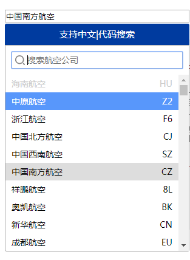
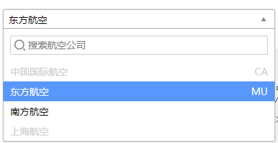
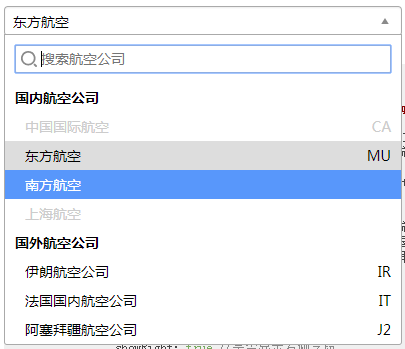

# 使用

## 绑定元素为`<input>`时

截图



示例代码：
```html
    <input type="text" class="demo-input" placeholder="选填（中文/代码）">

```
```js
    $('input.demo-input').SlwySelector({
        title: '支持中文|代码搜索',//自定义标题
        titleBar: true,//是否显示标题栏
        data: data,//自定义数据
        showField: 'CarrierName',//需要展示的自定义数据字段名
        showRight: true,//是否显示右侧字段
        showRightField: 'CarrierCode',//需要展示的右侧自定义数据字段名
        search: true,//是否显示搜索
        searchPlaceholder: '搜索航空公司'//搜索栏placeholder
    })
    //选择事件
    /*.on('selected', function (e) {
        console.log(e.value)
    })*/
```


## 绑定元素为`<select>`时

截图




示例代码：
```html
    <select name="select" class="demo-select">
        <option value="CA" data-right="CA" disabled>中国国际航空</option>
        <option value="MU" data-right="MU">东方航空</option>
        <option value="CZ">南方航空</option>
        <option value="FM" disabled>上海航空</option>
    </select>
```
```js
    $('select.demo-select').SlwySelector({
        showRight: true,//是否显示右侧字段
        search: true,//是否显示搜索
        searchPlaceholder: '搜索航空公司'//搜索栏placeholder
    })
    //选择事件
    /*.on('selected', function (e) {
        console.log(e.value)
    })*/
```


**使用自定义数据**

示例代码：

```html
    <select name="select" class="demo-select-optgroup-data">
    </select>
```
```json
    //自定义data
    [
        {
            "KeyID": 0,
            "CarrierCode": "HU",
            "CarrierShortName": "海南航空",
            "CarrierName": "海南航空",
            "SettleCode": "0",
            "CountryType": 0,
            "CountryTypeName": "国内",
            "IsDelete": 0,
            "AddTime": "0001-01-01T00:00:00",
            "AddUser": "",
            "ModifyUser": ""
        },
        ...
    ]
```
```js
    $('select.demo-select-data').SlwySelector({
        data: data,//自定义数据
        showField: 'CarrierName',//需要展示的自定义数据字段名
        showRight: true,//是否显示右侧字段
        showRightField: 'CarrierCode',//需要展示的右侧自定义数据字段名
        search: true,//是否显示搜索
        searchPlaceholder: '搜索航空公司'//搜索栏placeholder
    })
    //选择事件
    /*.on('selected', function (e) {
        console.log(e.value)
    })*/
```

!> 若同时存在`<option></option>`与自定义data，优先使用data


## 绑定有`optgroup`的`<select>`时

截图



示例代码：

```html
    <select name="select" class="demo-select-optgroup">
        <optgroup label="国内航空公司">
            <option value="CA" data-right="CA" disabled>中国国际航空</option>
            <option value="MU" data-right="MU">东方航空</option>
            <option value="CZ">南方航空</option>
            <option value="FM" disabled>上海航空</option>
        </optgroup>
        <optgroup label="国外航空公司">
            <option value="IR" data-right="IR">伊朗航空公司</option>
            <option value="IT" data-right="IT">法国国内航空公司</option>
            <option value="J2" data-right="J2">阿塞拜疆航空公司</option>
        </optgroup>
    </select>
```
```js
    $('select.demo-select-optgroup').SlwySelector({
        showRight: true,//是否显示右侧字段
        search: true,//是否显示搜索
        searchPlaceholder: '搜索航空公司'//搜索栏placeholder
    })
    //选择事件
    /*.on('selected', function (e) {
        console.log(e.value)
    })*/
```
            
**使用自定义数据**

示例代码：

```html
    <select name="select" class="demo-select-optgroup-data">
    </select>
```
```json
    //自定义data
    [
        {
            "label": "国内航空公司",
            "optgroup": true,
            "options": [
                {
                    "KeyID": 0,
                    "CarrierCode": "HU",
                    "CarrierShortName": "海南航空",
                    "CarrierName": "海南航空",
                    "SettleCode": "0",
                    "CountryType": 0,
                    "CountryTypeName": "国内",
                    "IsDelete": 0,
                    "AddTime": "0001-01-01T00:00:00",
                    "AddUser": "",
                    "ModifyUser": ""
                },
                ...
            ]
        },
        {
            "label": "国际航空公司",
            "optgroup": true,
            "options": [
                {
                    "KeyID": 0,
                    "CarrierCode": "AJ",
                    "CarrierShortName": "比利时空运公司",
                    "CarrierName": "比利时空运公司",
                    "SettleCode": "0",
                    "CountryType": 1,
                    "CountryTypeName": "国际",
                    "IsDelete": 0,
                    "AddTime": "0001-01-01T00:00:00",
                    "AddUser": "",
                    "ModifyUser": ""
                },
                ...
            ]
        }
    ]
```
```js
    //JS
    $('select.demo-select-optgroup-data').SlwySelector({
        data: data,//自定义数据
        showField: 'CarrierName',//需要展示的自定义数据字段名
        showRight: true,//是否显示右侧字段
        showRightField: 'CarrierCode',//需要展示的右侧自定义数据字段名
        search: true,//是否显示搜索
        searchPlaceholder: '搜索航空公司'//搜索栏placeholder
    })
    //选择事件
    /*.on('selected', function (e) {
        console.log(e.value)
    })*/
```

!> 若同时存在`<option></option>`与自定义data，优先使用data


## 多选`<select>`与自定义输入
**多选`<select>`**

截图


示例代码：

```html
    <select name="select" class="demo-select-multiple" multiple>
        <option value="CA" data-right="CA" disabled>中国国际航空</option>
        <option value="MU" data-right="MU">东方航空</option>
        <option value="CZ">南方航空</option>
        <option value="FM">上海航空</option>
        <option value="FM">Joe</option>
    </select>
```
```js
    $('select.demo-select-multiple').SlwySelector({
        searchShowEmpty: false,
        multipleMaxCount: 9,
    })
```

> 不带自定义输入的多选`select`输入时只会搜索列表。`Backspace`后退键可删除选中元素


**带自定义输入的多选`<select>`**

截图


示例代码：

```html
    <select name="select" class="demo-select-multiple-custom" multiple>
        <option value="CA" data-right="CA" disabled>中国国际航空</option>
        <option value="MU" data-right="MU">东方航空</option>
        <option value="CZ">南方航空</option>
        <option value="FM">上海航空</option>
        <option value="FM">Joe</option>
    </select>
```
```js
    $('select.demo-select-multiple-custom').SlwySelector({
        multipleInputCustom: true,
        searchShowEmpty: false,
        multipleMaxCount: 9,
        multipleInputSeparator:[';', '；', ',']
    })
```

> 自定义输入时默认以中英文分号`;`，`；`完成输入，可通过修改选项`multipleInputSeparator`自定义分隔完成符。完成后的元素将被选中并添加到下拉列表中。


## 其他

### 自定义宽度

示例代码：

```html
    <select name="select" class="demo-other-width">
        <option value="CA" data-right="CA" disabled>中国国际航空</option>
        <option value="MU" data-right="MU">东方航空</option>
        <option value="CZ">南方航空</option>
        <option value="FM" disabled>上海航空</option>
    </select>
```
```js
    $('select.demo-other-width').SlwySelector({
        showRight: true,//是否显示右侧字段
        width: 300,
        search: true,//是否显示搜索
        searchPlaceholder: '搜索航空公司'//搜索栏placeholder
    })
```

### 自定义每页显示数量

截图：


示例代码：

```html
    <select name="select" class="demo-other-viewCount">
    </select>
```
```js
    $('select.demo-other-viewCount').SlwySelector({
        data: data,//自定义数据
        showField: 'CarrierName',//需要展示的自定义数据字段名
        showRight: true,//是否显示右侧字段
        showRightField: 'CarrierCode',//需要展示的右侧自定义数据字段名
        viewCount: 15,//每页显示数量
        search: true,//是否显示搜索
        searchPlaceholder: '搜索航空公司'//搜索栏placeholder
    })
```

### 自定义搜索字段

示例代码：

```html
    <select name="select" class="demo-other-searchField">
    </select>
```
```js
    $('select.demo-other-searchField').SlwySelector({
        data: data,//自定义数据
        showField: 'CarrierName',//需要展示的自定义数据字段名
        search: true,//是否显示搜索
        searchField: ['CarrierCode'],
        searchPlaceholder: '搜索航空公司'//搜索栏placeholder
    })
```

> 列表下显示的数据字段默认可被搜索，且不可更改，所以`searchField`声明的字段名并不会替换默认的搜索字段。


### 展开不自动聚焦到搜索框

默认情况下展开列表会自动聚焦搜索字段，可修改`searchAutoFocus`使其不聚焦

```html
    <select name="select" class="demo-other-searchField">
    </select>
```
```js
    $('select.demo-other-notSearchAutoFocus').SlwySelector({
        data: data,//自定义数据
        showField: 'CarrierName',//需要展示的自定义数据字段名
        search: true,//是否显示搜索
        searchPlaceholder: '搜索航空公司',//搜索栏placeholder
        searchAutoFocus: false
    })
```